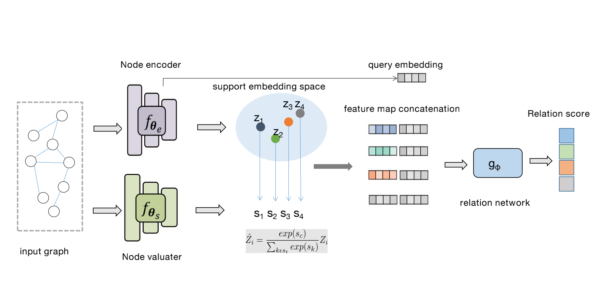

Graph Relation Networks for Few-shot Node Classification on Attributed Networks
============

## Graph Relation Networks (GRN)

This is the source code of paper ["Graph Relation Networks for Few-shot Node
Classification on Attributed Networks"](https://arxiv.org/pdf/2006.12739.pdf).


## Requirements
python==3.6.6 

torch==1.4.0


## dateSet
https://www.amazon.com/
https://dblp.uni-trier.de/

## Usage
```python GRN_train.py --shot 5 --way 5 --episodes 1000 --dataset dblp --dropout 0.5 --use_cuda```
```python GRN_train.py --shot 5 --way 5 --episodes 1000 --dataset Amazon_clothing --dropout 0.5 --use_cuda```
```python GRN_train.py --shot 5 --way 5 --episodes 1000 --dataset Amazon_eletronics --dropout 0.5 --use_cuda```


